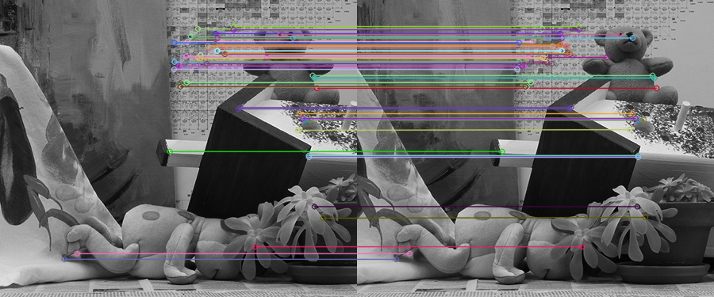
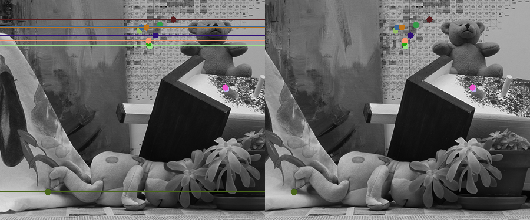
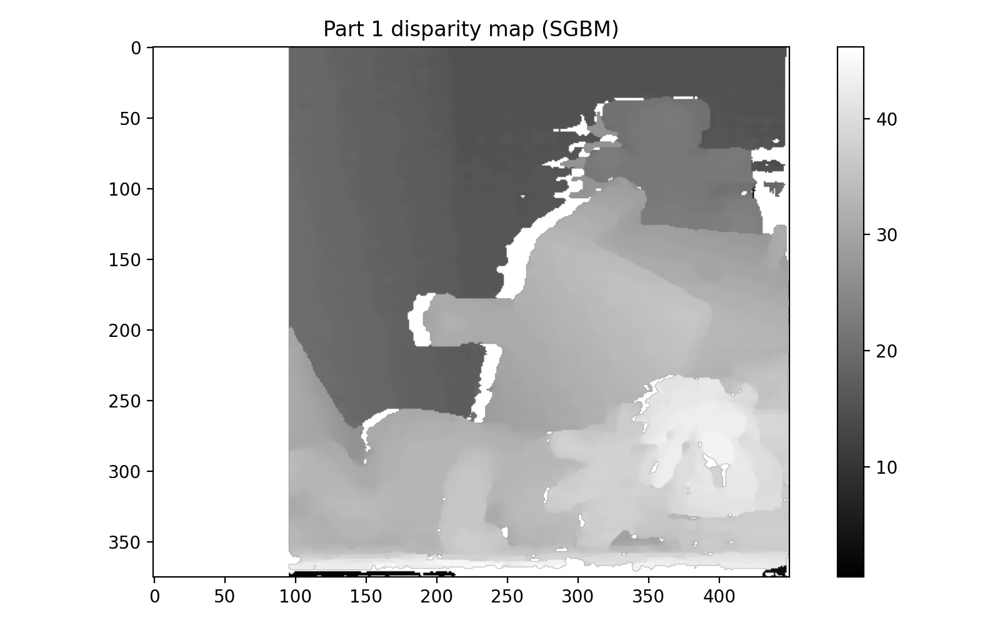
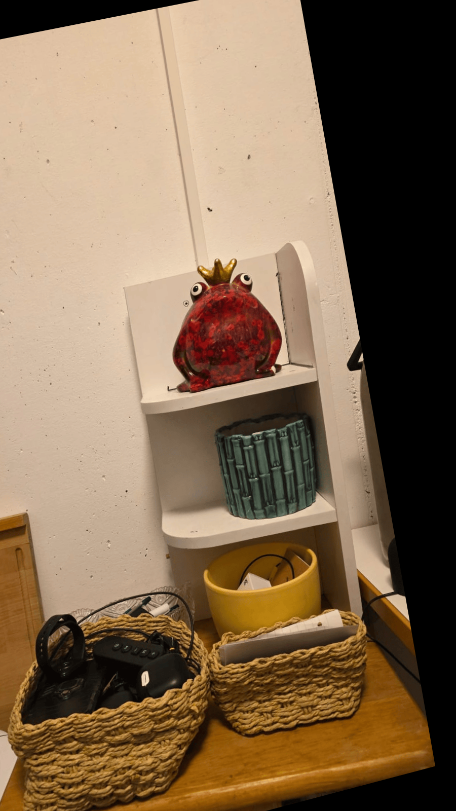
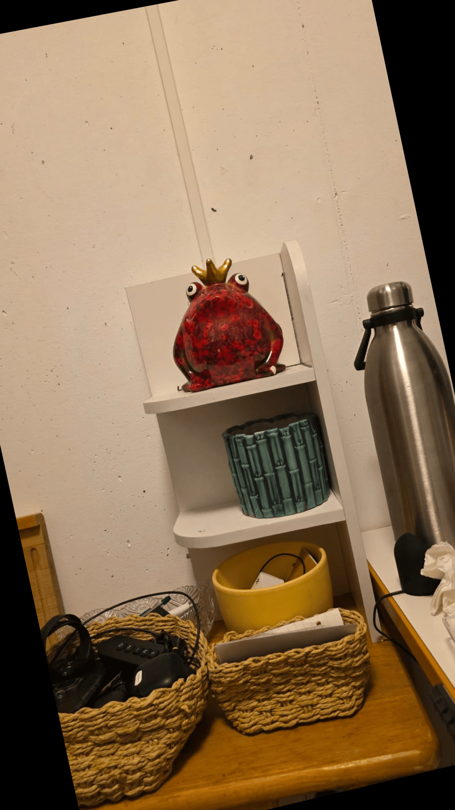
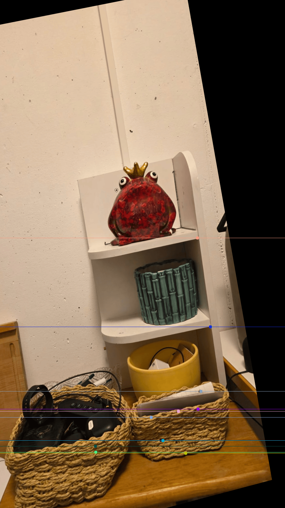
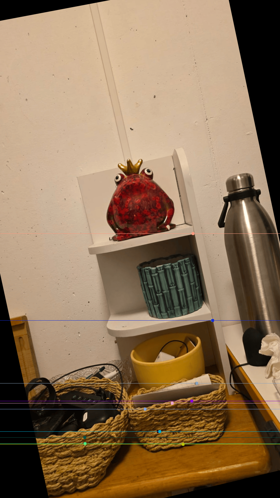
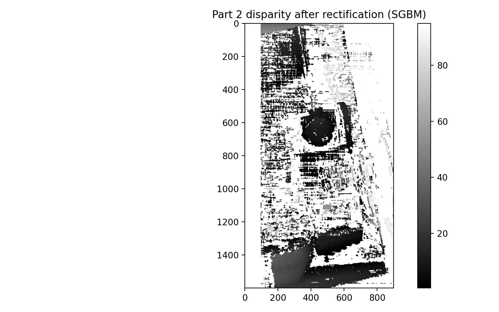

# Stereo Vision Depth Estimation using Disparity and Epipolar Geometry

## Project Overview
This project implements a stereo vision pipeline for estimating scene structure from a pair of images using disparity-based depth cues. It combines classical computer vision techniques including feature matching, fundamental matrix estimation, epipolar geometry analysis, uncalibrated stereo rectification, and dense disparity computation.

The system estimates relative depth from disparity maps derived from stereo image pairs, without performing metric depth reconstruction due to the absence of camera calibration parameters.

The repository was adapted from an academic project into a structured, portfolio-ready implementation that emphasizes both the underlying geometry and the resulting visual outputs.

## Objectives
The project focuses on four main goals:
- detect and match visual features across stereo image pairs
- estimate the fundamental matrix and visualize epipolar constraints
- compute disparity maps using two stereo matching approaches
- compare disparity quality before and after uncalibrated rectification

## Methods

### Part 1: Stereo Matching and Epipolar Geometry
The first part uses a reference stereo image pair to:
- detect ORB features and compute brute-force descriptor matches
- estimate the fundamental matrix with RANSAC
- visualize epipolar lines on the matched image pair
- compute disparity maps using:
  - **SGBM (Semi-Global Block Matching)**
  - **NCC (Normalized Cross-Correlation)**

### Part 2: Uncalibrated Rectification and Depth Comparison
The second part uses a captured stereo pair to:
- estimate a new fundamental matrix from feature correspondences
- perform uncalibrated stereo rectification from matched points
- verify rectification qualitatively through horizontal epipolar line alignment
- recompute disparity maps before and after rectification

## Why Rectification Matters
In unrectified stereo pairs, corresponding points can appear along general epipolar lines, which makes matching more difficult. Rectification warps the images so that epipolar lines become approximately horizontal. This reduces the correspondence search from a 2D problem to a 1D scanline problem and typically improves stereo matching quality.

## Key Results

### Feature Matching
Feature correspondences were recovered using ORB keypoints and a brute-force Hamming matcher.



### Epipolar Geometry
The estimated fundamental matrix was used to draw epipolar lines, showing the geometric relationship between the stereo views.



### Disparity from the Raw Stereo Pair
SGBM produced a cleaner disparity map than the local NCC baseline, especially in structured regions.



### Rectification Output
The captured stereo pair was rectified using an uncalibrated homography-based approach.

| Rectified Left | Rectified Right |
|---|---|
|  |  |

### Epipolar Alignment After Rectification
After rectification, corresponding points align much more closely with horizontal scanlines.

| Left Image | Right Image |
|---|---|
|  |  |

### Disparity After Rectification
Stereo matching on rectified images yields a more appropriate geometry for scanline-based correspondence estimation.



## Technical Insights
- **SGBM** is more robust than basic NCC because it incorporates smoothness constraints and handles moderately ambiguous regions better.
- **NCC** provides a useful local baseline, but it is noisier in weakly textured regions and more sensitive to local ambiguity.
- **RANSAC-based fundamental matrix estimation** removes bad matches and improves epipolar geometry estimation.
- **Uncalibrated rectification** can still significantly simplify correspondence search even without known camera intrinsics.

## Tech Stack
- Python
- OpenCV
- NumPy
- Matplotlib
- SciPy

## Project Structure
```text
stereo-vision-depth-estimation/
│
├── data/
│   ├── raw/
│   ├── captured/
│   └── README.md
├── images/
├── outputs/
│   ├── part1/
│   └── part2/
├── report/
│   └── README.md
├── src/
│   └── pcv/
│       ├── geometry.py
│       ├── io_utils.py
│       ├── rectification.py
│       ├── stereo.py
│       └── visualization.py
├── run_part1.py
├── run_part2.py
├── requirements.txt
├── pyproject.toml
├── .gitignore
└── README.md
```

## How to Run
Clone the repository and install the dependencies:

```bash
git clone <your-repo-link>
cd stereo-vision-depth-estimation
pip install -r requirements.txt
```

Run Part 1:

```bash
python run_part1.py
```

Run Part 2:

```bash
python run_part2.py
```

Generated outputs are saved under:
- `outputs/part1/`
- `outputs/part2/`

## Limitations
- The project estimates **relative stereo geometry**, not metric 3D reconstruction.
- Camera intrinsics are not used, so the rectification is uncalibrated.
- Weakly textured regions still produce noisy or incomplete disparity estimates.
- Results depend on image quality, viewpoint overlap, and the strength of feature correspondences.

## Future Improvements
- add calibrated stereo reconstruction using known camera intrinsics
- estimate depth in metric units from camera baseline and focal length
- compare more stereo methods, including modern learning-based approaches
- add quantitative disparity evaluation on a benchmark dataset

## Author
Ravi Kumar Pal
